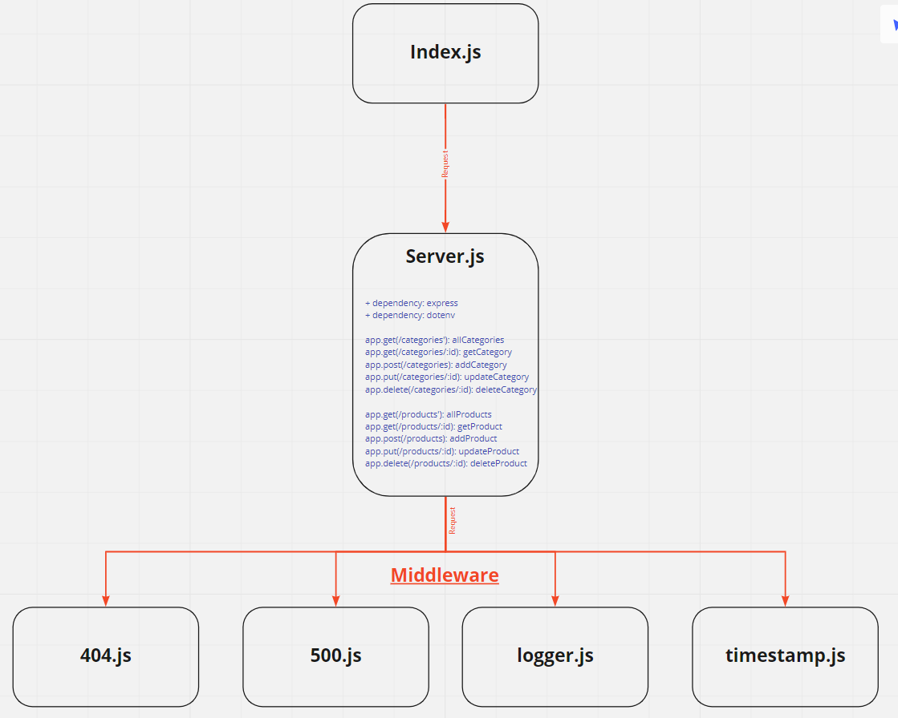

# LAB - Class 07

## Project: API Server

### Author: Abdulhakim Zatar

### Links and Resources

- [Visual Validation](https://javascript-401.netlify.app/) Click the “Module 2 (API)” Storefront link
- [Swagger Documentation](https://app.swaggerhub.com/apis/AbdulhakimZatar/api-server/0.1)

### Setup

#### `.env` requirements

i.e.

- `PORT` - Port Number

#### How to initialize/run your application

- `npm init -y`
- `npm i express dotenv`
- `npm i -D jest supertest`(For tests)

#### How to use your library

- `node index.js`

#### UML

