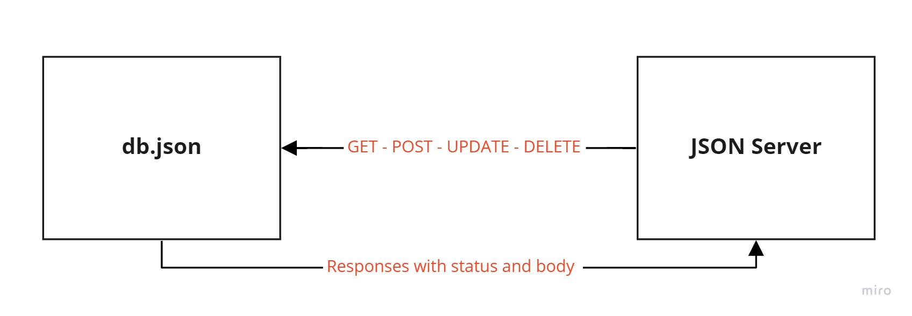

# LAB - Class 06

## Project: API Server

### Author: Abdulhakim Zatar

### Links and Resources

- [Visual Validation](https://javascript-401.netlify.app/) Click the “Module 2 (API)” Storefront link
- [Swagger Documentation](https://app.swaggerhub.com/apis/AbdulhakimZatar/api-server/0.1)

### Setup

#### How to initialize/run your application (where applicable)

- e.g. `npm install -g json-server`

#### How to use your library (where applicable)

- `json-server --watch ./data/db.json`

#### UML

